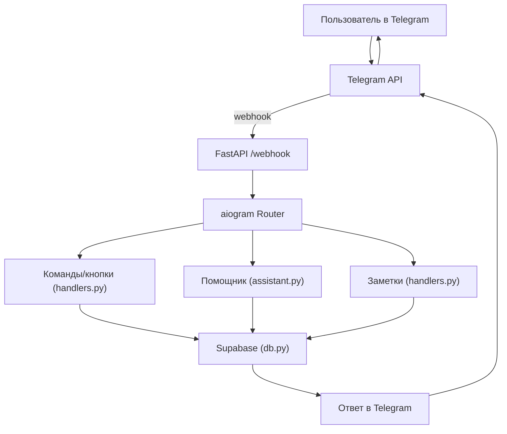
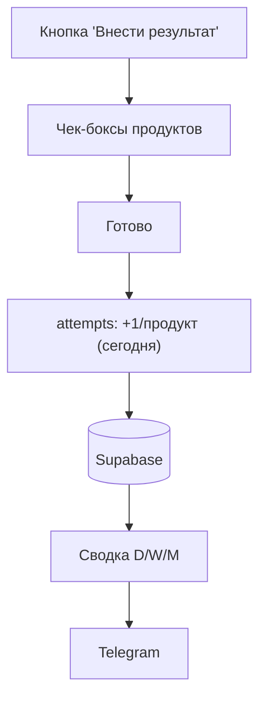
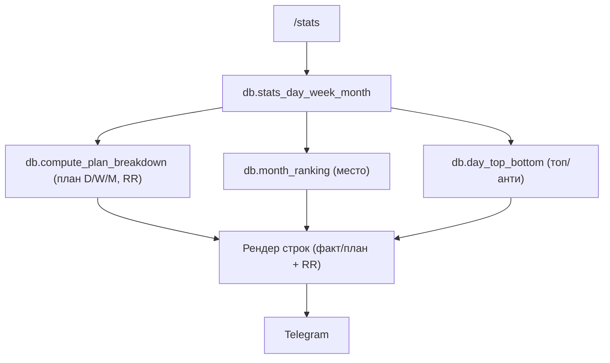
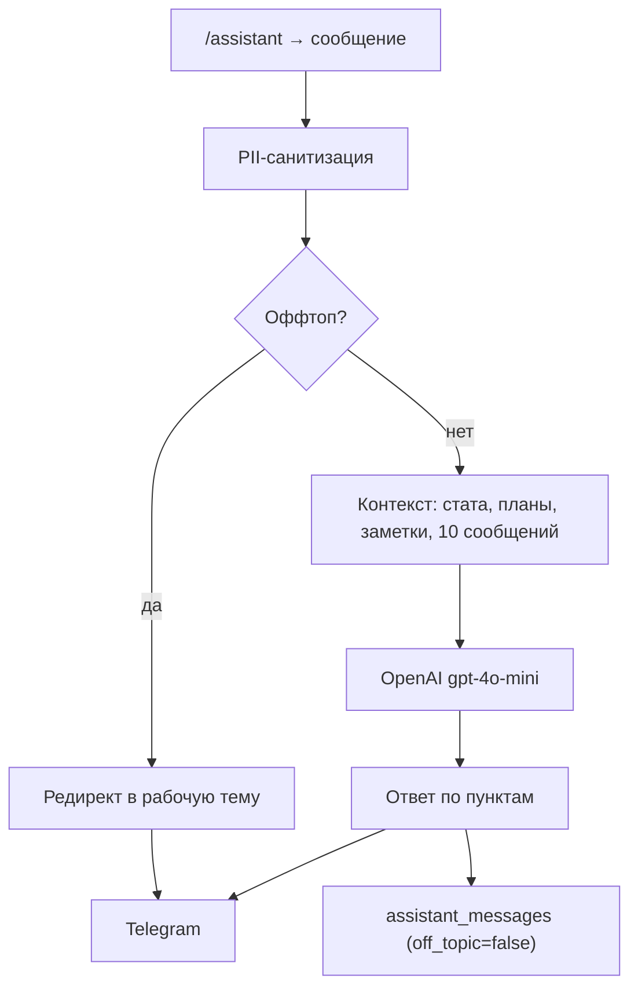
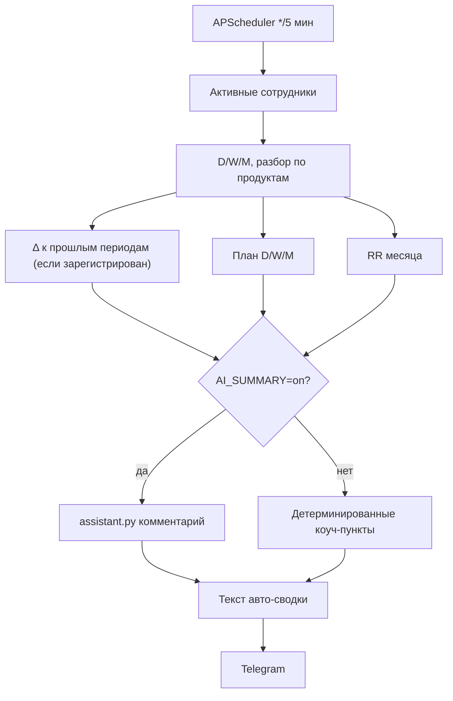
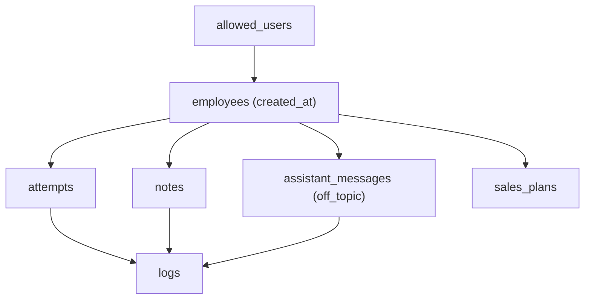

### Взаимодействие систем (Mermaid диаграммы)

#### Webhook и хендлеры

#### Внести результат (чек‑боксы)

#### Статистика (/stats)

#### Помощник (ИИ)

#### Авто‑сводка (APScheduler)

#### Модель данных (Supabase)
